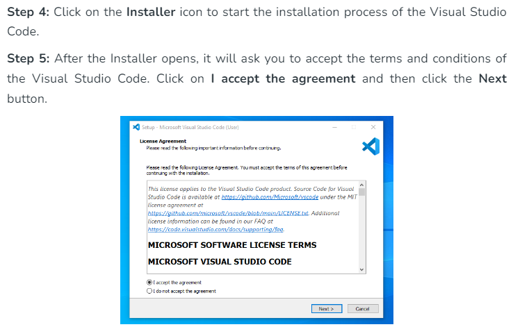
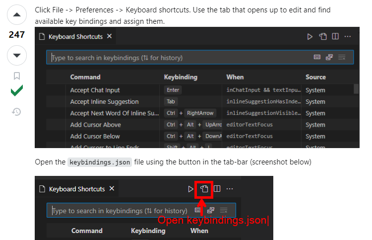
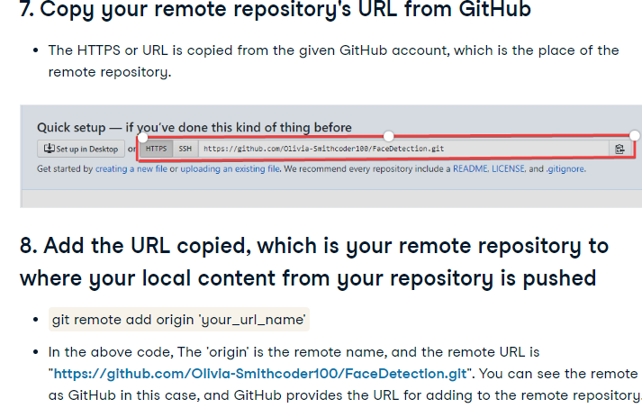

# SE-Assignment-5
Installation and Navigation of Visual Studio Code (VS Code)
 Instructions:
Answer the following questions based on your understanding of the installation and navigation of Visual Studio Code (VS Code). Provide detailed explanations and examples where appropriate.

 Questions:

1. Installation of VS Code:
   - Describe the steps to download and install Visual Studio Code on Windows 11 operating system. Include any prerequisites that might be needed.

2. First-time Setup:
   - After installing VS Code, what initial configurations and settings should be adjusted for an optimal coding environment? Mention any important settings or extensions.

**To make your development quicker and life easier, install a number of the Visual Studio Extensions that square measure outlined below and create your development a lot of and a lot of power tools than the alternative.**

- The Bracket Pair Colorizer extension. (Deprecated)
- The change-case extension.
- The Code Spell Checker extension.
- The Duplicate Selection extension.
- The EditorConfig for VS Code extension.
- The VSCode React Refactor extension.
- The npm Intellisense extension.
- The ESLint extension.
- The ES7 React/Redux/GraphQL/React-Native snippets extension.
- The Prettier – Code formatted extension.

3. User Interface Overview:
   - Explain the main components of the VS Code user interface. Identify and describe the purpose of the Activity Bar, Side Bar, Editor Group, and Status Bar.

**Basic Layout**

VS Code comes with a simple and intuitive layout that maximizes the space provided for the editor, while leaving ample room to browse and access the full context of your folder or project. The user interface is divided into five main areas:

*Editor* - The main area to edit your files. You can open as many editors as you like side by side vertically and horizontally.
*Primary Side Bar *- Contains different views like the Explorer to assist you while working on your project.
*Status Bar* - Information about the opened project and the files you edit.
*Activity Bar* - Located on the far left-hand side. Lets you switch between views and gives you *additional context*-specific indicators, like the number of outgoing changes when Git is enabled. You can change the position of the Activity Bar.
*Panel *- An additional space for views below the editor region. By default, it contains output, debug information, errors and warnings, and an integrated terminal. The Panel can also be moved to the left or right for more vertical space.

4. Command Palette:
   - What is the Command Palette in VS Code, and how can it be accessed? Provide examples of common tasks that can be performed using the Command Palette.

**The Command** Palette provides access to many commands. You can run editor commands, open files, search for symbols, and see a quick outline of a file, all using the same interactive window. Here are a few tips: Ctrl+P enables you to navigate to any file or symbol by typing its name.

VS Code is equally accessible from the keyboard. The most important key combination to know is Ctrl+Shift+P, which brings up the Command Palette.

5. Extensions in VS Code:
   - Discuss the role of extensions in VS Code. How can users find, install, and manage extensions? Provide examples of essential extensions for web development.

VS Code extensions let you add languages, debuggers, and tools to your installation to support your development workflow. VS Code's rich extensibility model lets extension authors plug directly into the VS Code UI and contribute functionality through the same APIs used by VS Code.

*Essential extensions for web development*

6. Integrated Terminal:
   - Describe how to open and use the integrated terminal in VS Code. What are the advantages of using the integrated terminal compared to an external terminal?

Add terminal instances by selecting the + icon on the top-right of the TERMINAL panel, selecting a profile from the terminal dropdown, or by triggering the Ctrl+Shift+` command. This action creates another entry in the tab list associated with that terminal.

Remove terminal instances by hovering a tab and selecting the Trash Can button, selecting a tab item and pressing Delete, using Terminal: Kill the Active Terminal Instance command, or via the right-click context menu.

Navigate between terminal groups using focus next Ctrl+PageDown and focus previous Ctrl+PageUp.

Icons may appear to the right of the terminal title on the tab label when a terminal's status changes. Some examples are a bell (macOS) and for tasks, displaying a check mark when there are no errors and an X otherwise. Hover the icon to read status information, which may contain actions

**Advantages of using the intergrated terminal compared to external terminal**
Seamless Integration: The integrated terminal is directly embedded within VS Code, meaning you don't have to switch between different applications or windows. This integration leads to a smoother workflow and reduces context-switching.

*Accessibility:* The terminal is easily accessible with a shortcut (Ctrl + ` on Windows/Linux, Cmd + ` on macOS) or through the View menu. This quick access saves time and effort compared to launching an external terminal separately.

*Workspace Context:* The integrated terminal automatically opens at the root of your current workspace or project. This context-awareness is beneficial for running scripts, managing dependencies, and executing commands related to your project without navigating manually.

*Customization:* VS Code allows customization of the integrated terminal's appearance, behavior, and shell settings. You can choose different shell environments (e.g., PowerShell, Bash, Command Prompt) and configure specific settings like shell path, font size, and color schemes to suit your preferences.

*Interaction with Editor:* You can interact with the editor and terminal simultaneously, making it easier to test code snippets, run build commands, debug applications, and view terminal output directly within your coding environment.

*Output Management:* The integrated terminal keeps a history of commands executed, making it easy to refer back to previous commands or outputs. This history can be scrolled through and reused as needed, enhancing productivity during development tasks.

*Extension Integration:* Extensions within VS Code often integrate with the integrated terminal, offering additional functionalities such as running specialized tasks, executing tests, or interacting with external tools seamlessly from within the editor.

*Cross-Platform Consistency:* VS Code and its integrated terminal provide a consistent experience across different operating systems (Windows, macOS, Linux), ensuring developers can leverage the same features and workflows regardless of the platform they are using.

7. File and Folder Management:
   - Explain how to create, open, and manage files and folders in VS Code. How can users navigate between different files and directories efficiently?

Another way to create files and folders in VS Code is to right click in the Explorer view. The right click menu will bring up the following options (among others) if you right click on an empty spot in the Explorer (the commands in the menu will vary depending on where you click): New File. New Folder.

Hold Ctrl and press Tab to view a list of all files open in an editor group. To open one of these files, use Tab again to pick the file you want to navigate to, then release Ctrl to open it. Alternatively, you can use Ctrl+Alt+- and Ctrl+Shift+- to navigate between files and edit locations.

8. Settings and Preferences:
   - Where can users find and customize settings in VS Code? Provide examples of how to change the theme, font size, and keybindings.

9. Debugging in VS Code:
   - Outline the steps to set up and start debugging a simple program in VS Code. What are some key debugging features available in VS Code?

1. Install Necessary Extensions (if not already installed):

**Debugger Extension:** Ensure you have the appropriate debugger extension installed for your programming language.

 *For example:*
For Python: Install the "Python" extension by Microsoft.
For JavaScript/Node.js: Install the "Node.js" extension.

2. **Configure Debugger:**
Open your project folder in VS Code.

**Create or open the file you want to debug.**

Ensure your code has necessary debug statements (e.g., breakpoints) inserted where you want to pause execution and inspect variables.

3. **Launch Configuration:**
VS Code uses launch configurations (stored in launch.json) to specify how to start your program in debug mode. Here’s how to set it up:

a. Automatically Generated Configuration:

Open the Run view by clicking on the Run icon in the Activity Bar on the side (or use Ctrl + Shift + D).

Click on the gear icon (create a launch.json file), and select your environment (e.g., Node.js, Python).

VS Code may generate a basic launch.json file with default settings. You might need to modify it based on your project structure and requirements.

b. Manually Editing launch.json (if needed):

If a launch.json file is not automatically created, or if you need to customize it further:

Click on the gear icon (create a launch.json file) and choose "Add Configuration...".

Select the appropriate environment and modify the generated launch.json file to specify details such as program entry points, arguments, and environment variables.

4. **Start Debugging:**
Once your launch.json configuration is set up:

a. Set breakpoints in your code by clicking on the gutter next to the line numbers or pressing F9.

b. Press F5 or click on the green play button in the Debug view to start debugging.

c. Your program will start executing, and it will pause at the breakpoints you set, allowing you to inspect variables, step through code (F10 for step over, F11 for step into), and interact with the debug console.

5. **Debugging Controls:**

While debugging, use the Debug toolbar (visible when debugging is active) to control execution:
Continue: Resume execution (F5).
Step Over: Execute the current line and move to the next (F10).
Step Into: Move into the function call on the current line (F11).
Step Out: Finish executing the current function and return to its caller.
Restart: Restart debugging session.
Stop: Stop debugging session.

6. **View Output:**
Use the Debug Console (Ctrl + `) to view program output, console.log statements, and interact with the debugger's output.

7. **Customize and Troubleshoot:**
Adjust launch.json configurations as needed for different environments or debugging scenarios.
Check the VS Code documentation or community resources for troubleshooting common debugging issues.

Breakpoints:

Set breakpoints by clicking in the gutter next to line numbers or pressing F9.
Conditional breakpoints allow pausing execution based on specific conditions.
Step Through Execution:

Step Over (F10): Execute the current line and move to the next line in the current file.
Step Into (F11): Move into the function call on the current line, allowing you to step into functions.
Step Out: Finish executing the current function and return to its caller.
Debug Console:

Interact with the debugged application via the integrated debug console (Ctrl + `).
View console.log statements and execute JavaScript expressions during debugging sessions.
Watch and Variables:

Watch: Add variables or expressions to monitor their values as you step through code.
Variables: Inspect local and global variables in the current scope while debugging.
Call Stack:

View the current execution stack (call hierarchy) to understand the path that led to the current point in the code.
Debugging Configuration:

Customize debugging configurations (launch.json) for different environments and scenarios.
Configure program entry points, arguments, environment variables, and more.
Multi-session Debugging:

Debug multiple sessions concurrently, allowing you to debug client-server setups or microservices.
Integrated Terminal:

Debug directly within the integrated terminal (Ctrl + `), allowing interaction with shell commands and debugging output simultaneously.
Extensions:

Extend debugging capabilities with various language-specific extensions (e.g., Python, JavaScript, C++) that provide additional features and integrations with external tools.
Conditional Breakpoints and Hit Counts:

Set breakpoints that only trigger under specific conditions (e.g., when a variable reaches a certain value).
Specify hit counts to break after a breakpoint has been hit a specified number of times.
Exception Handling:

Configure how VS Code handles exceptions, including breaking on unhandled exceptions or specific types of exceptions.
Task Debugging:

Debug tasks defined in tasks.json, allowing for debugging of build tasks or custom scripts directly from VS Code.

10. Using Source Control:
    - How can users integrate Git with VS Code for version control? Describe the process of initializing a repository, making commits, and pushing changes to GitHub.

If your workspace is on your local machine, you can enable Git source control by creating a Git repository with the Initialize Repository command. When VS Code doesn't detect an existing Git repository, the Source Control view will give you the options to Initialize Repository or Publish to GitHub.

 Submission Guidelines:
- Your answers should be well-structured, concise, and to the point.
- Provide screenshots or step-by-step instructions where applicable.
- Cite any references or sources you use in your answers.
- Submit your completed assignment by 1st July 

